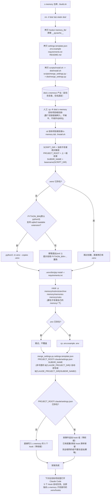

## 1. 适用场景

把 `c-memory` 这套记忆系统装进**另一个**项目（目标项目）里使用。整个过程分两段，跑在两个不同的目录下：

1. **打包**：在 `c-memory` 仓库自己的目录下执行 `build.sh`，产出 `dist/.c-memory/`。
2. **部署**：把 `dist/.c-memory/` 这个**自包含子目录**（隐藏目录，跟 `.venv`/`.serena` 一类工具目录的命名习惯一致）放进目标项目根目录，在这个子目录里执行 `install.sh`。

两段职责不同，不能颠倒或跳过——`build.sh` 只在 `c-memory` 仓库里跑一次（产出物跟目标项目无关），`install.sh` 在**每一个**要接入 c-memory 的目标项目里都要单独跑一次。

**部署形态是自包含子目录，不是摊平进项目根目录**：`hooks/`、`memory_lib/`、`memory/`、`.venv/`、`.env` 全部留在这一个子目录里，跟目标项目自己的文件不混在一起，可以整体删除/更新/加进 `.gitignore`。目标项目根目录只多一个文件——`.claude/settings.json`（由 `install.sh` 合并写入，hook 命令自动带上子目录路径前缀，不会覆盖已有配置）。

## 2. 整体流程

阅读目的：确认从执行 `build.sh` 到目标项目里 hooks 真正生效之间，每一步的输入输出和失败分支。



## 3. 执行步骤（命令）

### 3.1 打包（在 `c-memory` 仓库根目录）

```bash
cd /path/to/c-memory
./build.sh
```

产出 `dist/.c-memory/`（`dist/` 只是构建产物的落脚目录，`.c-memory/` 这一层才是真正自包含的部署单元，包名固定为隐藏目录，不用用户手动加/改名），内容清单：

```
dist/.c-memory/
├── hooks/{observe,extract,inject,summarize}.py
├── memory_lib/**/*.py
├── settings.template.json      # 不叫 .claude/settings.json，避免覆盖目标项目已有配置
├── merge_settings.py           # install.sh 用它做真正的合并
├── install.sh
├── .env.example
├── requirements.txt
└── README.md
```

**不打包**：真实 `.env`（含密钥）、`memory/` 下已积累的 instincts/memories/rules（那是 c-memory 自己仓库的运行痕迹，不属于发布内容）、`tests/`、`docs/`。

### 3.2 部署（自包含子目录）

```bash
cp -R /path/to/c-memory/dist/.c-memory /path/to/target-project/
cd /path/to/target-project/.c-memory
./install.sh
```

子目录名默认叫 `.c-memory`（隐藏目录，跟 `dist/` 下的目录名一致，也符合 `.venv`/`.serena` 这类工具目录不显眼的惯例）。如果手动改了名字，`install.sh` 会自动识别自己所在的目录名（`basename`）并用作 hook 命令的路径前缀，改名后也能正常工作，不需要额外配置。**唯一约束**：这个子目录必须是目标项目**根目录的直接子目录**（不能再嵌套一层），因为 `.claude/settings.json` 只会往上找一级。

如果目标项目的默认 `python3` 不支持 `sqlite3` loadable extension（macOS 系统自带的 `/usr/bin/python3` 通常不支持，`install.sh` 会先探测并直接报错退出，不会跑到一半才失败）：

```bash
PYTHON_BIN=/opt/homebrew/bin/python3 ./install.sh
# 或用 conda 提供的 Python，见 c-memory 仓库 README.md「安装」一节
```

## 4. `install.sh` 具体做了什么

按顺序执行，全部具备"已存在则跳过/不覆盖"的幂等性，可重复执行：

| 步骤 | 动作 | 幂等性 |
|---|---|---|
| 0 | 识别 `SCRIPT_DIR`（自己所在子目录）/ `PROJECT_ROOT`（上一级）/ `SUBDIR_NAME` | 每次运行都重新计算，无状态 |
| 1 | 建 `.venv --copies`（在子目录内） | `.venv/` 已存在则跳过 |
| 2 | `pip install -r requirements.txt` | 天然幂等（pip 自身处理） |
| 3 | 建 `memory/instincts/archive`、`memory/memories`、`memory/rules`（子目录内） | `mkdir -p`，天然幂等 |
| 4 | `.env.example` → `.env`（子目录内） | `.env` 已存在则跳过，不覆盖已填的密钥 |
| 5 | `merge_settings.py` 把 `settings.template.json` 的 hook 命令加上 `${CLAUDE_PROJECT_DIR}/SUBDIR_NAME/` 前缀后，合并进 `PROJECT_ROOT/.claude/settings.json` | 按"事件+组"去重追加，重复执行不产生重复条目 |

## 5. 部署后验证

```bash
cd /path/to/target-project
cat .claude/settings.json        # 确认 PostToolUse/Stop/PreCompact/SessionEnd/SessionStart 都在，
                                  # 且 command 里带着 .c-memory/（或你重命名后的子目录名）前缀
ls .c-memory/memory/             # 确认 instincts/ memories/ rules/ 目录已建好（子目录内）
cat .c-memory/.env               # 确认变量都是可选的，未填也能跑（降级为规则+TF-IDF）
```

之后在目标项目里正常用 Claude Code 工作即可，无需额外操作。首次真正验证闭环生效，参考 c-memory 仓库 README.md「如何验证闭环生效」一节（多跑几次真实会话，检查 `.c-memory/memory/instincts/*.md` 是否被识别、`.c-memory/memory/rules/auto-evolved.md` 是否更新）。

## 6. 已知限制

- **无法自动合并 `merge_settings.py` 之外的其他 `.claude/` 内容**（比如 `settings.local.json`、`.claude/agents/` 等），只处理 `.claude/settings.json` 里的 `hooks` 字段。
- **子目录不能再嵌套**：`install.sh` 只把 `.claude/settings.json` 写到上一级目录，如果把 `.c-memory` 子目录又塞进了别的子目录（比如 `target-project/tools/.c-memory/`），路径前缀和 `.claude/settings.json` 位置都会算错。
- **不会跨版本自动升级**：目标项目部署后的 `hooks/`/`memory_lib/` 是当时打包的快照，c-memory 仓库后续更新不会自动同步，需要重新走一遍 §3 流程（`install.sh` 的幂等性保证重新部署不会破坏已有的 `memory/` 数据和 `.env`；重新合并 `.claude/settings.json` 时同一批 hook 组不会重复追加）。
- **`PYTHON_BIN` 只影响建 `.venv` 那一步**：如果目标机器上确实没有任何支持 loadable extension 的 Python，`sqlite-vec`（`memory_lib/vector_cache.py` 依赖）装不上，需要按 README 里的方法先装一个支持的 Python（conda/homebrew）。
