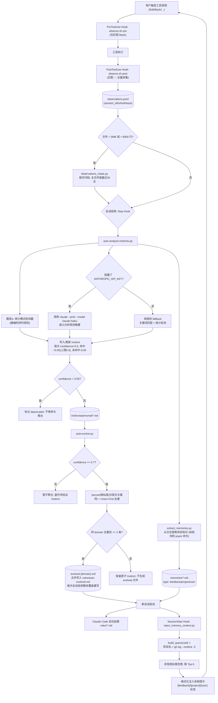

# Claude Code 自动记忆系统：核心思路与实现方式

> 综合总结自两篇文章：
> - 《让 Claude Code 拥有自我进化和记忆系统｜得物技术》（晴天，得物技术，2026-06-10）—— 原始设计
> - 《给 Claude Code 装一套自动记忆系统：得物的设计实现》（精神抖擞王大鹏，2026-07-18）—— 对照设计的开源复刻实现
>
> 原文全文见同目录下：
> [2026-07-27-让claude-code拥有自我进化和记忆系统-得物技术.md](./2026-07-27-让claude-code拥有自我进化和记忆系统-得物技术.md)、
> [2026-07-27-给claude-code装一套自动记忆系统-得物的设计实现.md](./2026-07-27-给claude-code装一套自动记忆系统-得物的设计实现.md)

## 要解决的问题

Claude Code 每次新会话都是一张白纸：项目用什么包管理器、代码风格偏好、"改完不要自动提交"这类工作习惯，全部归零，需要用户重复解释。这些细节里，项目级配置（如"用 pnpm"）可以写进 CLAUDE.md，但个人行为习惯（如"Edit 前先 Read"）用户自己往往意识不到是一条"规则"，也不可能让团队每个人手动维护一份行为规则库。两篇文章要解决的就是：**让 Agent 从用户的真实操作行为中自动学习，而不是依赖手写配置**。

## 核心思路

1. **确定性观测，而非依赖模型自觉**：早期用 Skill 触发学习，但 Skill 依赖模型主动调用，触发率不稳定；改用 Claude Code 原生 Hook 机制（`PreToolUse`/`PostToolUse`/`Stop`/`SessionStart`）后，工具调用的记录变成系统级、100% 确定性触发，不再依赖模型"愿不愿意"记录。
2. **行为模式与知识分开建模**：
   - **Instinct（行为模式）**：从"做了什么"里提炼"应该怎么做"，如"Edit 前先 Read"，是过程性、可复用的操作习惯。
   - **Memory（知识记忆）**：解决过的 Bug、技术决策、项目上下文（"用 pnpm"、"测试框架是 vitest"），是陈述性事实。
   - 两者互补，分别有独立的存储、置信度/生命周期机制。
3. **置信度是时间维度上的信任累积，而非一次性判定**：新发现的模式初始置信度 0.5，每次会话再次观测到 +0.05，未观测到 -0.05；达到 0.7 才正式生效（约需 2-3 天的重复验证），跌破 0.55 自动废弃。系统因此具备"强化 + 遗忘"能力，偶发行为会被自然淘汰，稳定习惯才会沉淀成规则。
4. **统计规则与语义理解双路径互补**：统计路径（硬编码序列检测器）不依赖 LLM、部署即可用，但需要数据积累；语义路径把观测摘要交给小模型（Claude Haiku）做语义分析，能捕获统计规则识别不到的深层模式，但需要 API Key。两条路径并行产出 Instinct，互相补位。
5. **主动注入优于被动等待**：记忆的价值只有被"召回并送到模型面前"才能生效，所以设计上不等用户提问，而是在 `SessionStart` 阶段就主动把最相关的记忆注入系统提示，保证第一条消息前上下文已就绪。
6. **原子性优先，避免过早抽象**：一个 Instinct 只对应一个 trigger + action，先积累原子规则，同域规则数量足够多（≥2 条）再聚合成 `evolved-*.md`，不做提前泛化。
7. **隐私边界内置于架构**：原始观测数据（Observations）只留本地，对外导出只分享提炼后的 Instinct 模式规则，不含代码路径或会话内容；向量化用本地 Embedding 模型，避免把可能含敏感信息的记忆发到云端。
8. **防膨胀是长期运行的必要设计，不是事后补丁**：数据层（观测按月归档、Instinct 低置信度废弃、Memory 按类型 TTL）和索引层（MEMORY.md 按优先级裁剪、规则文件每次覆盖重写、语义去重）分层控制体积。

## 实现方式

### 三层架构 + 数据流闭环

系统分三个子系统，通过 Hook 串联成一个自学习闭环：

- **行为观测层（Observation Engine）**：Hook 触发，写 JSONL 观测流。
- **模式提炼层（Instinct Engine）**：会话结束时分析观测流，产出并演化 Instinct 规则。
- **记忆注入层（Memory Engine）**：把知识性记忆和已生效的 Instinct 规则在新会话启动时注入上下文。

下图描述从一次工具调用到影响下一次会话的完整数据流（阅读目的：定位每个阶段由哪个脚本负责、在什么条件下走哪条分支）。

**各节点实现要点：**

- `observe.sh pre/post`：输入为 Hook 通过 stdin 传入的 JSON（字段名 `tool_response` 等，Claude Code 官方文档未列全 schema，需要查源码 `coreSchemas.ts` 确认）；输出为追加写入 `observations.jsonl` 一行记录；做隐私过滤（正则去除 API Key）和 5 分钟内的去重。**关键实现坑**：Hook 每次调用都是独立 fork 进程，模块级内存变量（如去重用的 dict）不会跨调用存活，必须把去重状态持久化到文件，否则会对同一文件的连续 Read 写入多条重复记录。
- `auto-analyze-instincts.py`：输入是当前会话的观测流片段；依赖 `ANTHROPIC_API_KEY` 决定是否走语义路径；失败行为——API 调用失败或未配置 Key 时自动降级为纯规则 fallback，不中断整体流程。
- `extract_memories.py`：架构设计中容易被漏掉的一环——"记忆 → 注入"有 `inject_memory_context.py` 负责读，但"观测 → 记忆"必须有一个显式的写入者，否则注入脚本每次读到的都是空文件。
- `auto-evolve.py`：输入是全部 Instinct 文件；核心是 Jaccard 相似度去重时**只提取英文关键词**分词，这样即使用户中英文混用描述同一习惯，也能被识别为同一模式合并；输出是覆盖重写 `rules/auto-evolved.md`。
- `inject_memory_context.py`：查询构造仅用 `$PWD` 项目名 + 最近 3 条 git commit，不依赖用户输入；召回用向量余弦相似度取 Top-5，避免全量记忆塞入 prompt 导致 token 膨胀。

### 数据模型

- **Instinct**（`instincts/personal/*.md`）：YAML frontmatter 含 `id`/`trigger`/`confidence`/`domain`/`source`/`deprecated`/`observed_at`，正文分 `Action` 和 `Evidence` 两节。
- **Memory**（`memories/*.md`）：YAML frontmatter 含 `name`/`description`/`metadata.type`（`feedback`/`project`/`user` 等），正文含 `Why` 和 `How to apply`。

### 技术选型

- **Embedding**：得物原文用本地 `nomic-embed-text`（768 维）+ qdrant 向量库；复刻版为减少依赖改用 TF-IDF。两者的共同理由是隐私——记忆内容可能含项目路径、函数名等敏感信息，且当时 Claude 未开放独立 Embedding API，本地推理在 Apple 芯片上约 10ms/条，满足实时写入需求。
- **模式提炼的模型调用**：走 LLM 路径时用本地 CLI 调 `claude --print --model claude-haiku-4-5`，而非直接调 API，复用已登录的 CLI 会话。

### 防膨胀设计

| 层次 | 机制 |
|---|---|
| Observations | 超 5MB 或 8000 行按月自动归档，主文件只留最近 30 天 |
| Instinct | confidence < 0.55 标记 deprecated，不参与后续聚合 |
| Memory | 按类型设置 TTL（60-90 天） |
| MEMORY.md 索引 | 超 160 行按优先级裁剪 |
| auto-evolved.md | 每次会话结束整体覆盖重写，不做增量堆积 |
| 去重 | Jaccard 相似度 + Union-Find 合并重复 Instinct |

### 团队协作扩展（无需改架构）

把个人版记忆库路径换成仓库内文件（`.claude/team-memory.json`、`.claude/rules/team-rules.md`），frontmatter 加 `scope: team/personal` 字段按 scope 分流输出，团队成员通过 git pull 共享彼此沉淀的规则。

### 实测效果（得物原文，数月真实数据）

- 上下文冷启动时间：10 分钟 → 30 秒
- Token 消耗：降低约 78%
- 错误重复率：下降 80%
- 知识复利效应：第 1 个月规则稀少、ROI 低 → 第 3 个月十余条高置信度规则覆盖主要工作流 → 第 6 个月数百条 Instinct 积累、行为高度贴合个人习惯

## 两篇文章的关系与差异

复刻实现（第二篇）基本照搬了得物原文（第一篇）的三层架构和数据流，主要差异集中在工程细节的落地方式：

- 得物用 nomic-embed-text 做 768 维向量；复刻版用 TF-IDF 避免额外依赖。
- 得物按月归档历史；复刻版只做超限截断。
- 得物实现了 5 种统计检测器；复刻版实现了 3 种。
- 复刻版额外记录了三个从设计图到可运行代码之间才会暴露的坑：Hook 的 JSON 字段 schema 需要读源码确认、Hook 的 fork 进程模型要求去重状态持久化、"观测→记忆"这条箭头需要显式的写入者脚本。

代码仓库（复刻版，开源）：`github.com/ditingdapeng/agent-memory-system`
