## 1. 背景与目标

Claude Code 每次新会话都会丢失两类信息：

1. **项目级知识**（用什么包管理器、测试框架等）—— 部分能靠手写 `CLAUDE.md` 缓解。
2. **个人行为习惯**（改文件前先 Read、不自动 commit 等）—— 几乎没法穷举，因为使用者自己往往意识不到这是一条"规则"。

参考得物技术团队的设计思路（观察 → 提炼 → 注入三段式闭环 + 置信度演化），结合本仓库（`c-memory`）的实际情况重新规划实现方案。

**范围**：个人单机场景，暂不做团队协作分流。先在 `c-memory` 仓库自举验证闭环有效，再决定是否把行为习惯规则提升为 `~/.claude` 全局配置。

**与参考实现的主要差异**：

| 维度 | 得物原文 / 开源复刻版 | 本设计 |
|---|---|---|
| LLM 语义分析 | Claude Haiku | DeepSeek（`deepseek-chat`，OpenAI 兼容接口），Provider 抽象可换 |
| 记忆召回向量化 | nomic-embed-text（本地）/ TF-IDF | 火山引擎 Ark multimodal embedding（2048 维），Provider 抽象可换，fallback 到 TF-IDF |
| 历史归档 | 按月归档 / 仅截断 | 按大小+行数阈值触发的按月归档，主文件只留最近 30 天 |
| 存储位置 | 个人/团队分流 | 先落在项目目录 `memory/`，验证通过后再决定是否提升为全局 |
| 团队协作 | 支持 scope 分流 | 本期不做 |

## 2. 总体架构

阅读目的：理解一次工具调用如何变成观测数据、观测数据如何演化为规则/记忆、以及记忆如何在下次会话中被召回注入。

```mermaid
flowchart TD
    ToolCall["用户触发工具调用<br/>(Edit/Bash/Read/...)"]
    PostHook["PostToolUse Hook: observe.py<br/>(matcher: .*, 全量采集)"]
    PrivacyFilter["privacy.py 隐私过滤<br/>(正则屏蔽 key/token, 敏感文件名整条丢弃内容)"]
    DedupCheck{"5分钟内同(tool_name,input_digest)<br/>已记录过?"}
    DedupState[(".dedup_state.json<br/>(持久化去重状态)")]
    ObsDB[("SQLite: .observations.sqlite3<br/>observations(session_id/ts/tool_name/tool_input_json)")]

    ToolCall --> PostHook --> PrivacyFilter --> DedupCheck
    DedupCheck -- 是,跳过 --> ToolCall
    DedupCheck -- 否 --> ObsDB
    DedupCheck -. 查询/更新 .-> DedupState
    ObsDB -. "每次 INSERT 后顺带<br/>DELETE WHERE ts < 30天前" .-> ObsDB

    SessionEnd{"Stop Hook<br/>(每次 assistant 回复结束都触发，非仅会话末尾)"}
    ObsDB -. "按 session_id 查询" .-> SessionEnd
    SessionEnd --> Extract["extract.py 开始提炼"]

    Detectors["统计路径: detectors.py<br/>硬编码序列检测器"]
    LLMKeyCheck{"DEEPSEEK_API_KEY 已配置?"}
    DeepSeekAnalyze["DeepSeekProvider.analyze()<br/>语义分析会话观测摘要"]
    NullProvider["NullProvider(纯规则fallback)<br/>关键词匹配, 如检测pnpm命令"]

    Extract --> Detectors
    Extract --> LLMKeyCheck
    LLMKeyCheck -- 是 --> DeepSeekAnalyze
    LLMKeyCheck -- 否/调用超时5s --> NullProvider

    PatternCandidates["候选行为模式/项目知识"]
    Detectors --> PatternCandidates
    DeepSeekAnalyze --> PatternCandidates
    NullProvider --> PatternCandidates

    TypeCheck{"候选类型?"}
    ExistingCheck{"是否已存在同名 instinct?"}
    ConfInit["新建, confidence=0.5"]
    ConfHit["命中: confidence+0.05 (上限0.9)"]
    ConfMiss["预期未出现: confidence-0.05"]
    MemWrite[("memories/*.md<br/>type: project/user")]

    PatternCandidates --> TypeCheck
    TypeCheck -- 项目知识 --> MemWrite
    TypeCheck -- 行为模式 --> ExistingCheck
    ExistingCheck -- 否,新发现 --> ConfInit
    ExistingCheck -- 是,本次观测到 --> ConfHit
    ExistingCheck -- 是,预期出现但未观测到 --> ConfMiss

    DeprecateCheck{"confidence < 0.55?"}
    InstinctFile[("instincts/*.md")]
    ConfInit --> InstinctFile
    ConfHit --> InstinctFile
    ConfMiss --> InstinctFile
    InstinctFile --> DeprecateCheck
    DeprecateCheck -- 是 --> Deprecated["标记 deprecated<br/>30天后移入 instincts/archive/"]
    DeprecateCheck -- 否 --> PromoteCheck{"confidence >= 0.7?"}
    PromoteCheck -- 否 --> Pending["暂不入规则文件, 留作待验证"]
    PromoteCheck -- 是 --> RegenRules["整体重写 rules/auto-evolved.md<br/>按confidence降序, 上限30条"]

    NewSession["新会话启动"]
    RegenRules --> NewSession
    MemWrite --> NewSession
    Deprecated --> NewSession
    Pending --> NewSession

    SessionStartHook["SessionStart Hook: inject.py<br/>(含 /compact 触发的 SessionStart)"]
    ListPromoted["storage.list_promoted_instincts()<br/>直接读 instincts/*.md，非读 rules/auto-evolved.md 文件本身"]
    FormatHabit["格式化为 [habit][domain] pattern"]
    BuildQuery["构造查询 = 项目名 + git log --oneline -3"]
    EmbedKeyCheck{"ARK_API_KEY 已配置且探活成功?"}
    ArkEmbed["ArkProvider.embed()<br/>火山引擎Ark multimodal embedding，走 vector_cache.py sqlite-vec 缓存"]
    TfidfEmbed["TfidfProvider.embed()<br/>本地sklearn fallback，不缓存"]
    TopK["Top-5(缓存命中走sqlite-vec KNN，未命中走批量余弦相似度)"]
    FormatMem["格式化为 [project]/[user] 标签"]
    InjectCtx["拼接 [habit]+[project/user] 段<br/>通过 stdout 注入系统提示"]

    NewSession --> SessionStartHook
    SessionStartHook --> ListPromoted --> FormatHabit --> InjectCtx
    SessionStartHook --> BuildQuery --> EmbedKeyCheck
    EmbedKeyCheck -- 是 --> ArkEmbed --> TopK
    EmbedKeyCheck -- 否/探活失败 --> TfidfEmbed --> TopK
    TopK --> FormatMem --> InjectCtx
    InjectCtx --> ToolCall
```



### 各节点实现要点

| 节点 | 输入 | 输出 | 依赖 | 失败行为 |
|---|---|---|---|---|
| `observe.py` (PostHook) | stdin JSON (`session_id`/`tool_name`/`tool_input`/`tool_response`，字段名以 Claude Code 源码 `coreSchemas.ts` 为准) | `observation_store.append_observation()` 写入 `.observations.sqlite3` 一行 | 无外部依赖 | 任何异常吞掉+记 stderr，不阻塞工具调用 |
| `privacy.py` | 单条观测记录 | 过滤后的记录 | 无 | 正则不命中时保守放行原文（宁可漏过滤也不误删有效数据，靠后续人工审查兜底）— 但敏感文件名规则优先级更高，命中即整条丢内容 |
| `DedupCheck` | `(tool_name, input_digest)` + `.dedup_state.json` | 是否跳过写入 | 无 | 状态文件损坏/不存在时视为"未记录过"，重建文件 |
| `extract.py` (Stop，每次 assistant 回复结束都触发) | `observation_store.list_session_observations(session_id)` | 更新 `instincts/`/`memories/`/`rules/auto-evolved.md` | 可选 DeepSeek API | LLM 超时/报错 → 降级 `NullProvider`，不中断流程 |
| `detectors.py` | 会话内观测序列 | 候选模式列表 | 无 | 检测器抛异常时跳过该检测器，不影响其他检测器 |
| `confidence.py` | 候选模式 + 已有 instinct | 更新后的 confidence | 无 | 无 |
| `inject.py` (SessionStart，含 `/compact`) | `storage.list_promoted_instincts()` + 项目名/git log 召回 | stdout 注入文本（`[habit]`+`[project]`/`[user]`） | 可选 Ark API | 召回失败 → 空结果，不阻塞会话启动 |

## 3. 目录结构

```
c-memory/
├── .claude/settings.json      # Hook 注册（PostToolUse/Stop/SessionStart）
├── hooks/
│   ├── observe.py
│   ├── extract.py
│   └── inject.py
├── memory_lib/
│   ├── providers/
│   │   ├── llm.py             # LLMProvider 抽象 + DeepSeekProvider + NullProvider
│   │   └── embedding.py       # EmbeddingProvider 抽象 + ArkProvider + TfidfProvider
│   ├── detectors.py
│   ├── confidence.py
│   ├── dedup.py               # 语义去重：instincts 按 domain、memories 按 keywords 交集门槛
│   ├── privacy.py
│   ├── storage.py             # instincts/memories/rules 的 frontmatter 文件读写
│   ├── observation_store.py   # observations 的 SQLite 读写（实测后从 jsonl 迁移）
│   ├── vector_cache.py        # memories embedding 的 sqlite-vec 缓存（实测后追加）
│   └── recall.py
├── memory/                    # 数据落盘目录（可提交的是 instincts/memories/rules，其余 gitignore）
│   ├── .observations.sqlite3  # 观测记录（SQLite，取代原 observations.jsonl）
│   ├── .dedup_state.json
│   ├── .vector_cache.sqlite3  # embedding 缓存（sqlite-vec）
│   ├── instincts/*.md
│   ├── instincts/archive/*.md
│   ├── memories/*.md
│   └── rules/auto-evolved.md
├── tests/
├── requirements.txt
└── README.md
```

## 4. 数据模型

**`.observations.sqlite3`**（`observations` 表，实测后从 jsonl 迁移，理由见 8. 节）：
```sql
CREATE TABLE observations (
    id INTEGER PRIMARY KEY AUTOINCREMENT,
    session_id TEXT,
    ts TEXT NOT NULL,
    tool_name TEXT,
    tool_input_json TEXT NOT NULL  -- extract_behavioral_signal 过滤后的结构化信号，JSON 编码
)
-- 索引：session_id（Stop Hook 按会话查询）、ts（保留策略清理）
```

**Instinct**（`instincts/{id}.md`，YAML frontmatter + 正文）：
```yaml
id: edit-before-read
domain: file-editing
pattern: "Edit 前先 Read 同一文件"
confidence: 0.65
hit_count: 3
last_seen: 2026-07-27
scope: personal
deprecated: false
```

**Memory**（`memories/{id}.md`）：
```yaml
id: proj-pkg-manager
type: project
keywords: [pnpm, package-manager]
created: 2026-07-27
```

## 5. Provider 抽象接口

```python
# memory_lib/providers/llm.py
class LLMProvider(Protocol):
    def analyze(self, observations_summary: str, last_message: str = "") -> dict: ...  # {instincts: [...], project_facts: [...]}

class DeepSeekProvider(LLMProvider): ...   # requests 直连 OpenAI 兼容 /chat/completions，读 DEEPSEEK_API_KEY
class NullProvider(LLMProvider): ...       # 纯规则 fallback，不发网络请求

# memory_lib/providers/embedding.py
class EmbeddingProvider(Protocol):
    def embed(self, texts: list[str]) -> list[list[float]]: ...

class ArkProvider(EmbeddingProvider): ...   # 火山引擎 Ark，读 ARK_API_KEY/ARK_EMBEDDING_MODEL/ARK_EMBEDDING_BASE_URL
class TfidfProvider(EmbeddingProvider): ... # 本地 sklearn TfidfVectorizer
```

选型逻辑（`memory_lib/providers/__init__.py` 工厂函数）：启动时读 `.env`；`DEEPSEEK_API_KEY` 存在且非空 → `DeepSeekProvider`，否则 `NullProvider`；`ARK_API_KEY` 存在且探活成功（5s 超时）→ `ArkProvider`，否则 `TfidfProvider`。同一会话内不重复重试打服务。

### 5b. Embedding 缓存（实测后追加）

实测发现 `recall_top_k` 原本每次 `inject.py` 触发都会把 `[query] + 全部 memories 文本` 一起传给 `ArkProvider.embed()`，而 `ArkProvider.embed()` 是逐条发 HTTP 请求（不是批量接口）——memory 越多，每次新会话/新一轮启动就要打越多次网络请求，纯浪费，因为大部分 memory 内容压根没变。

追加 `memory_lib/vector_cache.py`，基于 `sqlite-vec`（SQLite loadable extension）做两件事：

- **按 memory_id 缓存向量**：`memory/.vector_cache.sqlite3` 里一张 `vec0` 虚拟表存向量、一张普通表存 `memory_id → content_hash → rowid` 映射。内容 hash 没变就直接复用缓存，不重新调 embedding API；只有新增/变更过的 memory 才真正触发 `embed_one()`。
- **KNN 检索下推到 SQL 层**：不再手算余弦相似度，直接 `SELECT rowid, distance FROM memory_vectors WHERE embedding MATCH ? AND k = ? ORDER BY distance`（注意：vec0 的 KNN 查询必须显式给 `k = ?` 或 `LIMIT`，且不能包在 JOIN 里，否则报 `A LIMIT or 'k = ?' constraint is required`——这是从真实报错里试出来的，不是文档一次看懂的）。

只用于 `EmbeddingProvider.SUPPORTS_CACHE = True` 的实现（目前只有 `ArkProvider`，`dim` 固定 2048）。`TfidfProvider` 每次都是对当批文本现场 `fit_transform`，向量空间本身不跨调用稳定，没法缓存，继续走原来的一次性批量 embed + `sklearn.metrics.pairwise.cosine_similarity` 那条路（`recall.py` 里按 `SUPPORTS_CACHE` 分流到两个内部函数）。

**环境依赖**：`sqlite-vec` 要求 Python 的 `sqlite3` 模块编译时开启 `enable_load_extension`，macOS 系统自带的 `/usr/bin/python3` 没有这个能力（属性直接不存在，不是被禁用）。本仓库改用 conda 提供的 Python 重建 `.venv`（`--copies` 保证不依赖 conda env 常驻），见 `README.md` 安装说明。副作用：顺带把 `python-frontmatter` 的版本号解开了（不再需要为兼容 Python 3.9 而钉 `==1.1.0`）。

已知限制：memory 被删除后，缓存里对应的向量行不会自动清理（孤儿数据），当前数据量小暂不实现淘汰。

### 5c. LLM 提示词对齐得物开源实现（2026-07-28 追加）

查了得物开源复刻仓库（`ditingdapeng/agent-memory-system`）`scripts/analyze_instincts.py`/`extract_memories.py` 的真实 prompt 原文（之前设计文档只有转述，没有原文），对照后把我们的 `_SYSTEM_PROMPT`（`memory_lib/providers/llm.py`）改了三处：

- **`domain` 收窄成固定枚举**：`workflow / testing / git / code-style / project-context`，之前是完全自由文本，LLM 可能每次给不同的 domain 词，间接影响 `find_similar_instinct` 的同 domain 门槛判断稳定性。
- **`project_facts` 加了排除清单**：得物原文明确写"不要提取：一次性的临时操作 / 过于细节的代码变更 / 显而易见的通用知识"——这正好对应我们之前发现的"memories 里全是文件存在性陈述"这个噪音问题的根因，之前一直没有对应的 prompt 约束。
- **`project_facts` 的 `type` 从单一 `"project"` 扩成四类枚举**：`project / feedback / error / workflow`，`inject.py` 的 `_format_memories` 对应加了 `[feedback]`/`[error]`/`[workflow]` 三种标签（原来只有 `[project]`/`[user]` 两种）。

同时给 `analyze()` 加了 `last_message` 参数——对齐得物 `extract_memories.py` 的数据源优先级：Stop Hook 官方提供 `last_assistant_message` 字段（文档明确写这是给 Stop/SubagentStop 场景设计的，比读 `transcript_path` 更可靠，因为 transcript 文件是异步写入、可能来不及包含最新一轮）。`_run_llm_analysis` 现在把这个字段和 observations 摘要一起喂给 LLM，`NullProvider`/统计路径不使用这个字段（跟得物一致，规则 fallback 路径不依赖对话文本）。

未对齐的部分：得物是 instincts/project_facts 两次独立 LLM 调用（两个脚本两个 prompt），我们仍然是一次 `analyze()` 调用两者都要——出于成本/延迟考虑保留合并调用，只对齐了 prompt 的内容要求，没有拆分成两次调用。LLM 输出的 `id`/`name` 字段（得物用于文件名）我们也没有采纳，继续用 `_slugify(pattern/fact)` + 语义去重生成 id，因为这条流水线已经在工作，没必要改。

## 6. 置信度演化参数

| 参数 | 值 |
|---|---|
| 初始 confidence | 0.5 |
| 命中一次 | +0.05（上限 0.9） |
| 预期未出现 | -0.05 |
| 写入 `rules/auto-evolved.md` 阈值 | >= 0.7 |
| 自动废弃阈值 | < 0.55 |
| 废弃后归档 | 30 天不再触发 → 移入 `instincts/archive/` |
| `rules/auto-evolved.md` 规则数上限 | 30 条（超出按 confidence 降序截断） |

以上均为常量，写在 `confidence.py` 顶部方便调整。

### 6b. 语义去重（实测后追加）

真实跑起来后发现：LLM 语义分析路径每次措辞不完全一样（"编辑文件前先阅读该文件" vs "编辑文件前先读取文件内容"），会把同一个真实习惯拆成好几条各自 confidence 很低的 instinct，永远凑不到 0.7 晋升阈值。追加一个轻量语义去重（`memory_lib/dedup.py`），不引入分词/embedding 依赖：

- `char_jaccard(a, b)`：去空白后按单字符集合算 Jaccard 相似度，中文短句场景够用，能扛住同义词替换
- `find_similar_instinct(pattern, domain, candidates)`：只在**同 domain** 内比较（domain 不同或任一为空直接跳过，避免跨主题误合并），相似度 >= `SIMILARITY_THRESHOLD`（0.45）且最高的一条判定为匹配
- `extract.py` 的 `_update_hit_instincts`：处理每个候选前先跑一次相似度匹配，命中则复用已有 instinct 的 id（走更新分支，`confidence`/`hit_count` 正常演化），未命中才退化为精确 slug 匹配/新建；同一次运行内也会实时更新内存快照，让同一轮内的多个候选互相合并
- 这是"轻量"版本，不是得物原文的 Jaccard(英文关键词) + Union-Find 方案，阈值也是拍脑袋定的粗调值，不保证覆盖所有换词场景（比如"修改代码前习惯先查看文件内容"这种用词差异更大的表述就没被上面两条捕获到）

## 7. 隐私过滤

### 7a. 2026-07-28：捕获范围改为对齐得物开源实现（重大变更）

最初设计（字段白名单）：`observe.py` 不管什么工具，`tool_response` 一律不落盘；`tool_input` 也不是原样存，`privacy.py` 的 `extract_behavioral_signal(tool_name, tool_input)` 按工具类型只保留行为信号字段（`Read`/`Edit`/`Write`/`MultiEdit` 只留 `file_path`，`Bash` 只留 `command`），`content`/`old_string`/`new_string` 一律丢弃。

对照得物开源实现（`ditingdapeng/agent-memory-system` 的 `scripts/observe.py`）发现对方是完整保留 `tool_input` + `tool_response` 前 500 字符，只靠 4 条正则做密钥脱敏——没有字段白名单。用户明确要求"完全对齐得物"，`extract_behavioral_signal` 已删除，现在的采集方式：

- `tool_input`：完整保留，不裁剪字段
- `tool_response`：是字符串时截取前 500 字符存进新增列 `tool_response_summary`，非字符串（大部分工具的结构化响应）直接丢弃，不做 JSON 序列化——这一点也是照抄得物的行为，不是我们自己加的限制
- 唯一的保护层退回到 `filter_sensitive`：正则脱敏 + 敏感文件名整条丢弃（这一层我们比得物严格——得物只有正则，没有敏感文件名整条丢弃这道门槛，是我们额外保留的兜底，不属于"对齐"范围）

**写入前 `filter_sensitive`**：

- 正则屏蔽：`sk-[A-Za-z0-9]{20,}`、`ark-[A-Za-z0-9-]{20,}`（本项目 Ark key 格式，得物没有）、通用 `(api[_-]?key|token|password)\s*[:=]\s*\S+`，叠加得物额外覆盖的 `ghp_[A-Za-z0-9]{36,}`（GitHub token）、`AKIA[A-Z0-9]{16}`（AWS key）、`Bearer\s+\S+`，命中替换为 `***REDACTED***`
- 敏感文件名整条丢内容（`tool_input`/`tool_response`/`tool_response_summary` 三个字段都覆盖）：路径匹配 `.env`/`.pem`/`.key`/`id_rsa`/`.npmrc`/`.aws`/`credentials`/`secrets` 关键字时，只保留 `tool_name` 和文件名，不留内容
- 测试用例直接取本仓库 `.env` 里真实格式的 key（值本身不进代码库，只用格式做正则测试 fixture）

## 8. 文件轮转/归档

- `.observations.sqlite3`（**实测后从 jsonl 迁移**，见下方说明）：每次 `append_observation` 插入后顺带 `DELETE WHERE ts < 30天前`，不再需要按大小/行数触发的整档案归档
- `instincts/`：`deprecated=true` 超过 30 天未再触发 → 移入 `instincts/archive/`
- `memories/`：同一 domain 下超过 50 条时触发去重/合并（不在本期实现细节内，先预留接口）；实测后已实现轻量版——`find_similar_memory` 按 `keywords` 交集门槛 + `char_jaccard`，见 6b 节
- `rules/auto-evolved.md`：每次 Stop Hook 后整体重写，硬上限 30 条

### 8b. observations 存储迁移到 SQLite（实测后追加）

最初设计是 `observations.jsonl` 按 5MB/8000 行触发、整档案追加到 `observations/{YYYY-MM}.jsonl`、主文件按时间戳筛选重写——实现后发现：

- 归档出去的月度文件从未被任何代码读取过（`grep` 全仓库确认），归档纯粹是"写出去但没人看"的死数据。
- 手写的轮转逻辑（区分"有时间戳"/"无时间戳"两类记录、按比例兜底保留）复杂度和它解决的实际问题不成正比——`observations` 里的 `ts` 字段其实恒不为空（`observe.py` 每次都写），无时间戳兜底分支从未真正触发过。
- 项目里已经因为 `memory_lib/vector_cache.py` 引入了 sqlite-vec，Python 环境已具备 SQLite loadable extension 能力，直接用标准 SQLite（不需要 vec 扩展）替换 jsonl 是顺理成章的一步。

迁移后（`memory_lib/observation_store.py`）：单表 `observations`，`session_id`/`ts` 建索引；`append_observation` 插入后顺带做一次 `DELETE WHERE ts < 30天前`；`.observations.sqlite3` 沿用 `.dedup_state.json`/`.vector_cache.sqlite3` 的 gitignore 策略，不纳入版本控制。`instincts/memories/rules` 三类因为需要 git 可读/可 diff/可手改，保留 frontmatter 文件形式，不迁移。

### 8c. Stop 增量处理 + 并发跳过（实测后追加）

迁移到 SQLite 之初，`extract.py` 仍是每次 Stop 触发就 `SELECT ... WHERE session_id = ?` 取**该 session 从头到现在的全部**观测——而 Stop 在一次会话里每个 assistant 回复结束都会触发一次，不是只在会话真正结束时触发一次。这意味着同一批早期观测会被反复重新喂给 LLM 分析，且 `_summarize()` 按工具分组只取每类**最前面** 3 条做示例，会话越长，例子越陈旧、越不能反映最新行为。

改成增量处理（`observation_store.py` 新增 `session_progress` 表：`session_id`/`last_processed_id`/`status`/`updated_at`）：

- `try_claim_session(session_id)`：非阻塞认领——`status='processing'` 且未超过 `STALE_PROCESSING_SECONDS`(600s) 视为"另一次处理正在跑"，直接返回 `None`，调用方跳过本次触发，不同步等待；否则原子地把状态改成 `processing` 并返回 `last_processed_id`（上次处理到的 id）。
- `list_new_session_observations(session_id, after_id)`：只取 `id > after_id` 的增量记录。
- `release_session(session_id, last_processed_id)`：处理结束后（无论成功/异常，`extract.py` 用 `try/finally` 保证一定执行）推进游标、状态改回 `idle`。

设计取舍：宁可偶尔丢一次处理（认领失败直接跳过、LLM 分析异常也照常推进游标不重试），不做同步等待或重试队列——能沉淀成 instinct 的行为模式本身就会多次触发，漏掉一次不影响最终收敛。

**连带的行为变更**：原来的 `_decay_missed_instincts`（本次候选没命中的活跃 instinct 一律 confidence -0.05）建立在"每次都看得到全会话历史"的前提上——换成小批量增量之后，一个只有两三条观测的小批次几乎不可能同时展示出所有已存在的行为模式，继续按批次衰减会让几乎所有 instinct 在几次 Stop 内被误判为"未观测到"而快速跌破 deprecate 阈值。这次改动**移除了这个衰减调用**，衰减机制需要重新设计（比如按 `last_seen` 距今天数做时间维度的衰减，而不是按"这一小批有没有命中"），暂缓实现。

## 9. 测试策略

- 单元测试：`confidence.py` 边界值（0.55/0.7/0.9）、`privacy.py` 正则过滤（用 `.env` 格式的假 key 做 fixture）、`detectors.py` 序列检测器
- Provider 集成测试：`DeepSeekProvider`/`ArkProvider` 打真实请求，标记 `pytest -m integration` 单独跑；`NullProvider`/`TfidfProvider` 无网络可跑
- 端到端自举验证：在 `c-memory` 仓库自己装上这套 Hook，重复几次"改文件前先 Read"类动作，观察 2-3 次会话后 `instincts/` 是否生成对应文件、confidence 是否按预期递增、`rules/auto-evolved.md` 是否被加载

## 10. 验收标准

1. 连续跑 3+ 次真实 Claude Code 会话，`observations.jsonl` 有数据、无密钥泄漏
2. 至少一条行为模式的 confidence 从 0.5 演化到 >=0.7 并出现在 `rules/auto-evolved.md`
3. 新会话启动时 `inject.py` 能召回相关项目记忆并通过 stdout 可见
4. 断网/无 key 时（模拟 DeepSeek/Ark 均不可用）整个闭环仍能跑通，仅降级为规则+TF-IDF

## 11. 依赖

```
requests
scikit-learn
python-frontmatter
python-dotenv
```

Python 版本：系统自带 `/usr/bin/python3`（3.9.6）即可，建议 `python3 -m venv .venv` 隔离依赖。
