## 1. 背景与目标

Claude Code 每次新会话都会丢失两类信息：

1. **项目级知识**（用什么包管理器、测试框架等）—— 部分能靠手写 `CLAUDE.md` 缓解。
2. **个人行为习惯**（改文件前先 Read、不自动 commit 等）—— 几乎没法穷举，因为使用者自己往往意识不到这是一条"规则"。

参考得物技术团队的设计思路（观察 → 提炼 → 注入三段式闭环 + 置信度演化），结合本仓库（`c-memory`）的实际情况重新规划实现方案。

**范围**：个人单机场景，暂不做团队协作分流。先在 `c-memory` 仓库自举验证闭环有效，再决定是否把行为习惯规则提升为 `~/.claude` 全局配置。

**与参考实现的主要差异**：

| 维度 | 得物原文 / 开源复刻版 | 本设计 |
|---|---|---|
| LLM 语义分析 | Claude Haiku | DeepSeek（`deepseek-chat`，OpenAI 兼容接口），Provider 抽象可换 |
| 记忆召回向量化 | nomic-embed-text（本地）/ TF-IDF | 火山引擎 Ark multimodal embedding（2048 维），Provider 抽象可换，fallback 到 TF-IDF |
| 历史归档 | 按月归档 / 仅截断 | 按大小+行数阈值触发的按月归档，主文件只留最近 30 天 |
| 存储位置 | 个人/团队分流 | 先落在项目目录 `memory/`，验证通过后再决定是否提升为全局 |
| 团队协作 | 支持 scope 分流 | 本期不做 |

## 2. 总体架构

阅读目的：理解一次工具调用如何变成观测数据、观测数据如何演化为规则/记忆、以及记忆如何在下次会话中被召回注入。

```mermaid
flowchart TD
    ToolCall["用户触发工具调用<br/>(Edit/Bash/Read/...)"]
    PostHook["PostToolUse Hook: observe.py<br/>(matcher: .*, 全量采集)"]
    PrivacyFilter["privacy.py 隐私过滤<br/>(正则屏蔽 key/token, 敏感文件名整条丢弃内容)"]
    DedupCheck{"5分钟内同(tool_name,input_digest)<br/>已记录过?"}
    DedupState[(".dedup_state.json<br/>(持久化去重状态)")]
    ObsLog[("observations.jsonl<br/>(session_id/ts/tool/digest)")]

    ToolCall --> PostHook --> PrivacyFilter --> DedupCheck
    DedupCheck -- 是,跳过 --> ToolCall
    DedupCheck -- 否 --> ObsLog
    DedupCheck -. 查询/更新 .-> DedupState

    SessionEnd{"会话结束: Stop Hook"}
    ObsLog -. 累积 .-> SessionEnd

    RotateCheck{"observations.jsonl<br/>>5MB 或 >8000行?"}
    Rotate["归档到 observations/2026-07.jsonl<br/>主文件只留最近30天"]
    SessionEnd --> RotateCheck
    RotateCheck -- 是 --> Rotate --> Extract
    RotateCheck -- 否 --> Extract["extract.py 开始提炼"]

    Detectors["统计路径: detectors.py<br/>硬编码序列检测器"]
    LLMKeyCheck{"DEEPSEEK_API_KEY 已配置?"}
    DeepSeekAnalyze["DeepSeekProvider.analyze()<br/>语义分析会话观测摘要"]
    NullProvider["NullProvider(纯规则fallback)<br/>关键词匹配, 如检测pnpm命令"]

    Extract --> Detectors
    Extract --> LLMKeyCheck
    LLMKeyCheck -- 是 --> DeepSeekAnalyze
    LLMKeyCheck -- 否/调用超时5s --> NullProvider

    PatternCandidates["候选行为模式/项目知识"]
    Detectors --> PatternCandidates
    DeepSeekAnalyze --> PatternCandidates
    NullProvider --> PatternCandidates

    TypeCheck{"候选类型?"}
    ExistingCheck{"是否已存在同名 instinct?"}
    ConfInit["新建, confidence=0.5"]
    ConfHit["命中: confidence+0.05 (上限0.9)"]
    ConfMiss["预期未出现: confidence-0.05"]
    MemWrite[("memories/*.md<br/>type: project/user")]

    PatternCandidates --> TypeCheck
    TypeCheck -- 项目知识 --> MemWrite
    TypeCheck -- 行为模式 --> ExistingCheck
    ExistingCheck -- 否,新发现 --> ConfInit
    ExistingCheck -- 是,本次观测到 --> ConfHit
    ExistingCheck -- 是,预期出现但未观测到 --> ConfMiss

    DeprecateCheck{"confidence < 0.55?"}
    InstinctFile[("instincts/*.md")]
    ConfInit --> InstinctFile
    ConfHit --> InstinctFile
    ConfMiss --> InstinctFile
    InstinctFile --> DeprecateCheck
    DeprecateCheck -- 是 --> Deprecated["标记 deprecated<br/>30天后移入 instincts/archive/"]
    DeprecateCheck -- 否 --> PromoteCheck{"confidence >= 0.7?"}
    PromoteCheck -- 否 --> Pending["暂不入规则文件, 留作待验证"]
    PromoteCheck -- 是 --> RegenRules["整体重写 rules/auto-evolved.md<br/>按confidence降序, 上限30条"]

    NewSession["新会话启动"]
    RegenRules --> NewSession
    MemWrite --> NewSession
    Deprecated --> NewSession
    Pending --> NewSession

    LoadRules["Claude Code 自动加载 rules/*.md"]
    SessionStartHook["SessionStart Hook: inject.py"]
    BuildQuery["构造查询 = 项目名 + git log --oneline -3"]
    EmbedKeyCheck{"ARK_API_KEY 已配置且探活成功?"}
    ArkEmbed["ArkProvider.embed()<br/>火山引擎Ark multimodal embedding"]
    TfidfEmbed["TfidfProvider.embed()<br/>本地sklearn fallback"]
    CosineTopK["余弦相似度检索, 取Top-5"]
    InjectCtx["格式化为[project]/[user]标签<br/>通过stdout注入系统提示"]

    NewSession --> LoadRules
    NewSession --> SessionStartHook --> BuildQuery --> EmbedKeyCheck
    EmbedKeyCheck -- 是 --> ArkEmbed --> CosineTopK
    EmbedKeyCheck -- 否/超时5s --> TfidfEmbed --> CosineTopK
    CosineTopK --> InjectCtx
    InjectCtx --> ToolCall
```



### 各节点实现要点

| 节点 | 输入 | 输出 | 依赖 | 失败行为 |
|---|---|---|---|---|
| `observe.py` (PostHook) | stdin JSON (`session_id`/`tool_name`/`tool_input`/`tool_response`，字段名以 Claude Code 源码 `coreSchemas.ts` 为准) | 写 `observations.jsonl` 一行 | 无外部依赖 | 任何异常吞掉+记 stderr，不阻塞工具调用 |
| `privacy.py` | 单条观测记录 | 过滤后的记录 | 无 | 正则不命中时保守放行原文（宁可漏过滤也不误删有效数据，靠后续人工审查兜底）— 但敏感文件名规则优先级更高，命中即整条丢内容 |
| `DedupCheck` | `(tool_name, input_digest)` + `.dedup_state.json` | 是否跳过写入 | 无 | 状态文件损坏/不存在时视为"未记录过"，重建文件 |
| `extract.py` (Stop) | 累积的 `observations.jsonl` | 更新 `instincts/`/`memories/`/`rules/auto-evolved.md` | 可选 DeepSeek API | LLM 超时/报错 → 降级 `NullProvider`，不中断流程 |
| `detectors.py` | 会话内观测序列 | 候选模式列表 | 无 | 检测器抛异常时跳过该检测器，不影响其他检测器 |
| `confidence.py` | 候选模式 + 已有 instinct | 更新后的 confidence | 无 | 无 |
| `inject.py` (SessionStart) | 项目名 + git log | stdout 注入文本 | 可选 Ark API | 召回失败 → 空结果，不阻塞会话启动 |

## 3. 目录结构

```
c-memory/
├── .claude/settings.json      # Hook 注册（PostToolUse/Stop/SessionStart）
├── hooks/
│   ├── observe.py
│   ├── extract.py
│   └── inject.py
├── memory_lib/
│   ├── providers/
│   │   ├── llm.py             # LLMProvider 抽象 + DeepSeekProvider + NullProvider
│   │   └── embedding.py       # EmbeddingProvider 抽象 + ArkProvider + TfidfProvider
│   ├── detectors.py
│   ├── confidence.py
│   ├── privacy.py
│   ├── storage.py
│   └── recall.py
├── memory/                    # 数据落盘目录（.env 同级 gitignore 掉，或按需提交做追踪）
│   ├── observations.jsonl
│   ├── observations/2026-07.jsonl   # 按月归档
│   ├── .dedup_state.json
│   ├── instincts/*.md
│   ├── instincts/archive/*.md
│   ├── memories/*.md
│   └── rules/auto-evolved.md
├── tests/
├── requirements.txt
└── README.md
```

## 4. 数据模型

**`observations.jsonl`**（每行一条）：
```json
{"session_id": "...", "ts": "2026-07-27T10:00:00", "tool_name": "Edit", "tool_input_digest": "...", "tool_response_digest": "..."}
```

**Instinct**（`instincts/{id}.md`，YAML frontmatter + 正文）：
```yaml
id: edit-before-read
domain: file-editing
pattern: "Edit 前先 Read 同一文件"
confidence: 0.65
hit_count: 3
last_seen: 2026-07-27
scope: personal
deprecated: false
```

**Memory**（`memories/{id}.md`）：
```yaml
id: proj-pkg-manager
type: project
keywords: [pnpm, package-manager]
created: 2026-07-27
```

## 5. Provider 抽象接口

```python
# memory_lib/providers/llm.py
class LLMProvider(Protocol):
    def analyze(self, observations_summary: str) -> dict: ...  # {instincts: [...], project_facts: [...]}

class DeepSeekProvider(LLMProvider): ...   # requests 直连 OpenAI 兼容 /chat/completions，读 DEEPSEEK_API_KEY
class NullProvider(LLMProvider): ...       # 纯规则 fallback，不发网络请求

# memory_lib/providers/embedding.py
class EmbeddingProvider(Protocol):
    def embed(self, texts: list[str]) -> list[list[float]]: ...

class ArkProvider(EmbeddingProvider): ...   # 火山引擎 Ark，读 ARK_API_KEY/ARK_EMBEDDING_MODEL/ARK_EMBEDDING_BASE_URL
class TfidfProvider(EmbeddingProvider): ... # 本地 sklearn TfidfVectorizer
```

选型逻辑（`memory_lib/providers/__init__.py` 工厂函数）：启动时读 `.env`；`DEEPSEEK_API_KEY` 存在且非空 → `DeepSeekProvider`，否则 `NullProvider`；`ARK_API_KEY` 存在且探活成功（5s 超时）→ `ArkProvider`，否则 `TfidfProvider`。同一会话内不重复重试打服务。

## 6. 置信度演化参数

| 参数 | 值 |
|---|---|
| 初始 confidence | 0.5 |
| 命中一次 | +0.05（上限 0.9） |
| 预期未出现 | -0.05 |
| 写入 `rules/auto-evolved.md` 阈值 | >= 0.7 |
| 自动废弃阈值 | < 0.55 |
| 废弃后归档 | 30 天不再触发 → 移入 `instincts/archive/` |
| `rules/auto-evolved.md` 规则数上限 | 30 条（超出按 confidence 降序截断） |

以上均为常量，写在 `confidence.py` 顶部方便调整。

## 7. 隐私过滤

写入 `observations.jsonl` 前统一经过 `privacy.py`：

- 正则屏蔽：`sk-[A-Za-z0-9]{20,}`、`ark-[A-Za-z0-9-]{20,}`、通用 `(api[_-]?key|token|password)\s*[:=]\s*\S+`，命中替换为 `***REDACTED***`
- 敏感文件名整条丢内容：`tool_input` 涉及路径匹配 `.env`/`*.pem`/`*credentials*` 时，只保留 `tool_name` 和文件名，不留内容
- 测试用例直接取本仓库 `.env` 里真实格式的 key（值本身不进代码库，只用格式做正则测试 fixture）

## 8. 文件轮转/归档

- `observations.jsonl`：Stop Hook 触发时检查，超过 5MB 或 8000 行则按月归档，主文件只留最近 30 天
- `instincts/`：`deprecated=true` 超过 30 天未再触发 → 移入 `instincts/archive/`
- `memories/`：同一 domain 下超过 50 条时触发去重/合并（不在本期实现细节内，先预留接口）
- `rules/auto-evolved.md`：每次 Stop Hook 后整体重写，硬上限 30 条

## 9. 测试策略

- 单元测试：`confidence.py` 边界值（0.55/0.7/0.9）、`privacy.py` 正则过滤（用 `.env` 格式的假 key 做 fixture）、`detectors.py` 序列检测器
- Provider 集成测试：`DeepSeekProvider`/`ArkProvider` 打真实请求，标记 `pytest -m integration` 单独跑；`NullProvider`/`TfidfProvider` 无网络可跑
- 端到端自举验证：在 `c-memory` 仓库自己装上这套 Hook，重复几次"改文件前先 Read"类动作，观察 2-3 次会话后 `instincts/` 是否生成对应文件、confidence 是否按预期递增、`rules/auto-evolved.md` 是否被加载

## 10. 验收标准

1. 连续跑 3+ 次真实 Claude Code 会话，`observations.jsonl` 有数据、无密钥泄漏
2. 至少一条行为模式的 confidence 从 0.5 演化到 >=0.7 并出现在 `rules/auto-evolved.md`
3. 新会话启动时 `inject.py` 能召回相关项目记忆并通过 stdout 可见
4. 断网/无 key 时（模拟 DeepSeek/Ark 均不可用）整个闭环仍能跑通，仅降级为规则+TF-IDF

## 11. 依赖

```
requests
scikit-learn
python-frontmatter
python-dotenv
```

Python 版本：系统自带 `/usr/bin/python3`（3.9.6）即可，建议 `python3 -m venv .venv` 隔离依赖。
