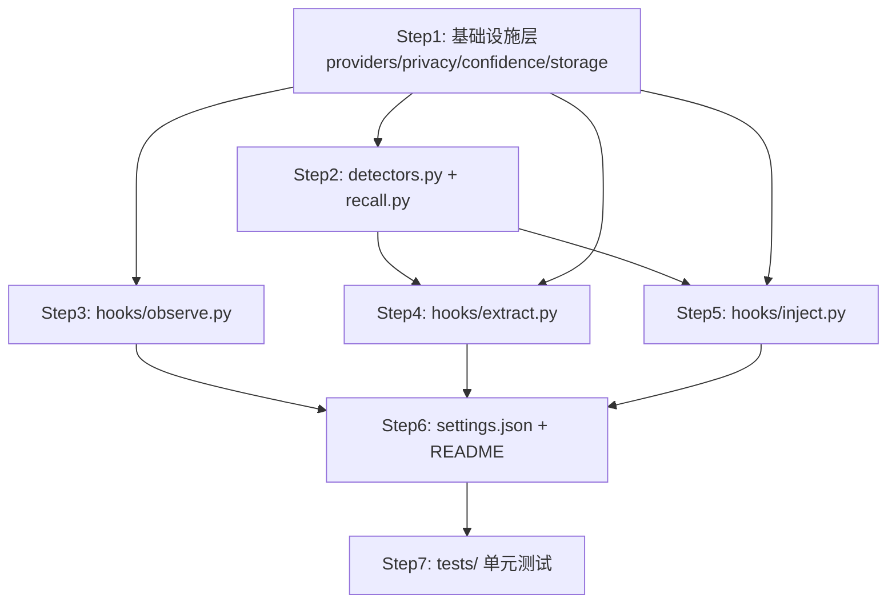

## 执行方式

按依赖关系拆成 7 个编码步骤，每步分配一个独立 subagent 实现（无跨步骤上下文，靠本计划 + 设计文档自包含描述）。依赖关系允许并行的步骤会并行派发，其余顺序执行。执行前均给 subagent 完整路径、依赖版本号、验收方式；每步完成后本会话做代码走查再进入下一步。

## Step 1：基础设施层（无依赖，先执行）

产出：
- `requirements.txt`
- `memory_lib/providers/llm.py`：`LLMProvider` Protocol + `DeepSeekProvider`（读 `.env` 的 `DEEPSEEK_API_KEY`/`LLM_MODEL`，用 `requests` 调 OpenAI 兼容 `/chat/completions`）+ `NullProvider`（纯规则 fallback，不发网络请求）+ 工厂函数按 key 是否存在选择
- `memory_lib/providers/embedding.py`：`EmbeddingProvider` Protocol + `ArkProvider`（读 `.env` 的 `ARK_API_KEY`/`ARK_EMBEDDING_BASE_URL`/`ARK_EMBEDDING_MODEL`，5s 超时探活失败即降级）+ `TfidfProvider`（sklearn `TfidfVectorizer` 本地兜底）+ 工厂函数
- `memory_lib/privacy.py`：正则过滤 `sk-[A-Za-z0-9]{20,}`、`ark-[A-Za-z0-9-]{20,}`、`(api[_-]?key|token|password)\s*[:=]\s*\S+` → `***REDACTED***`；敏感文件名（`.env`/`*.pem`/`*credentials*`）命中时整条记录只留 `tool_name`+文件名
- `memory_lib/confidence.py`：常量 `INITIAL=0.5, HIT_DELTA=+0.05, MISS_DELTA=-0.05, CAP=0.9, PROMOTE_THRESHOLD=0.7, DEPRECATE_THRESHOLD=0.55, RULES_LIMIT=30`；`update_confidence(instinct, hit: bool) -> float`
- `memory_lib/storage.py`：读写 `memory/observations.jsonl`（含轮转：>5MB 或 >8000 行时归档到 `memory/observations/YYYY-MM.jsonl`，主文件留最近 30 天）、`memory/instincts/*.md`、`memory/memories/*.md`、`memory/rules/auto-evolved.md`（frontmatter 用 `python-frontmatter` 库读写）、`memory/.dedup_state.json` 读写
- 在 `memory/` 下建好空目录骨架：`observations/`, `instincts/archive/`, `memories/`, `rules/`，用 `.gitkeep` 占位

验收：`python3 -m venv .venv && .venv/bin/pip install -r requirements.txt` 能装上；`python3 -c "from memory_lib.providers import get_llm_provider, get_embedding_provider"` 不报错。

依据：完整设计见 `docs/plans/2026-07-27-claude-code-memory-system-design.md` 第 3/4/5/6/7/8 节。

## Step 2：detectors.py + recall.py（依赖 Step1）

产出：
- `memory_lib/detectors.py`：至少 2 个硬编码统计检测器（如"Edit 前 N 次操作内是否有对同文件的 Read"），输入一个会话的 observation 列表，输出候选 pattern 字典列表
- `memory_lib/recall.py`：`build_query(cwd) -> str`（项目名 + `git log --oneline -3`）、`recall_top_k(query, memories, embedding_provider, k=5) -> list`（余弦相似度）

验收：单独 `python3` 交互式跑一遍 detectors/recall 函数，用构造的假数据验证输出结构正确。

## Step 3：hooks/observe.py（依赖 Step1，可与 Step2 并行）

产出：`hooks/observe.py`，PostToolUse Hook 脚本：读 stdin JSON（字段 `session_id`/`tool_name`/`tool_input`/`tool_response`，先去 Claude Code 源码 `coreSchemas.ts` 或官方文档确认真实字段名，若无法访问源码则按 Claude Code 官方 Hooks 文档的字段名实现并在代码注释标注来源）→ `privacy.py` 过滤 → 用 `storage.py` 里的去重状态查 5 分钟内是否重复 → 不重复则追加写 `observations.jsonl`。任何异常整体 try/except 吞掉 + 写 stderr，exit code 恒为 0（不阻塞工具调用）。

验收：`echo '{"session_id":"t","tool_name":"Read","tool_input":{"file_path":"a.py"}}' | python3 hooks/observe.py` 能正常退出且 `memory/observations.jsonl` 多一行。

## Step 4：hooks/extract.py（依赖 Step1+Step2）

产出：`hooks/extract.py`，Stop Hook 脚本：轮转检查 → 跑 detectors 统计路径 → 按工厂函数选择的 LLMProvider 做语义分析（超时/异常自动降级 NullProvider）→ 合并候选 → 用 confidence.py 更新/新建 instinct，写 `instincts/*.md`；项目知识写 `memories/*.md`；`confidence<0.55` 标记 deprecated；`confidence>=0.7` 触发整体重写 `rules/auto-evolved.md`（按 confidence 降序，上限 30 条）。同样整体 try/except，任何异常不影响会话结束。

验收：构造一个包含重复"Read 后 Edit 同文件"模式的假 `observations.jsonl`，跑 `python3 hooks/extract.py`，检查 `instincts/` 下生成对应文件且 confidence 符合预期。

## Step 5：hooks/inject.py（依赖 Step1+Step2，可与 Step4 并行）

产出：`hooks/inject.py`，SessionStart Hook 脚本：`build_query` 构造查询 → 用工厂函数选出的 EmbeddingProvider 对 query 和 `memories/*.md` 内容做 embedding（失败/超时降级 TfidfProvider）→ `recall_top_k` 取 Top-5 → 格式化 `[project]`/`[user]` 标签文本 → print 到 stdout。召回失败时输出空结果，exit code 恒为 0。

验收：`python3 hooks/inject.py` 手动跑，在有/无 `memories/*.md` 两种情况下都能正常退出并输出（后者输出为空文本，不报错）。

## Step 6：settings.json + README（依赖 Step3/4/5）

产出：
- `.claude/settings.json`：注册三个 Hook，命令用 `${CLAUDE_PROJECT_DIR}` 拼路径
- `README.md`：项目说明、目录结构、安装步骤（`python3 -m venv .venv` + `pip install -r requirements.txt` + `.env` 配置说明，注意不要提交 `.env`）、如何验证闭环生效

验收：`cat .claude/settings.json | python3 -m json.tool` 能正常解析。

## Step 7：tests/（依赖 Step6，即全部实现完成后）

产出：
- `tests/test_confidence.py`：边界值 0.55/0.7/0.9
- `tests/test_privacy.py`：用 `.env` 里真实格式（不含真实 key 值本身）的正则模式做 fixture，断言被替换成 `***REDACTED***`
- `tests/test_detectors.py`：构造假 observation 序列验证命中率
- `pytest.ini` 或 `pyproject.toml` 里标记 `integration` marker 给需要真实网络的用例（本步骤不强制写 provider 集成测试，作为可选项）

验收：`.venv/bin/pytest tests/ -m "not integration"` 全部通过。

## Step 8：端到端自举验证（人工执行，非 subagent）

在 `c-memory` 仓库自己启用这套 Hook，真实跑几次 Claude Code 会话，观察 `instincts/`、`rules/auto-evolved.md`、`inject.py` 输出是否符合设计文档第 10 节验收标准。这一步由用户在实现完成后手动进行，不适合交给 subagent（需要真实多轮会话交互）。
