## 1. 背景与目标

现有 `c-memory` 闭环（`observe.py`→`extract.py`→`inject.py`）解决的是"沉淀行为习惯/项目事实"这类**语义/程序性记忆**，颗粒度是单条规则或单条事实，跟具体某次对话内容无关。

但还有一类信息现有系统完全没覆盖：**"上一次会话我们聊到哪了、在做什么、决定了什么"**——这是**情景记忆**（episodic memory），每次 Claude Code 退出重开新会话就彻底丢失。官方提供的 `--resume`/`--continue` 能找回，但要重新加载整段历史 transcript，首次 token 消耗很大；很多时候用户只是想快速知道"接着上次做"，不需要逐字重放。

**目标**：新增一条独立管线，持续把会话内容（用户输入 + assistant 最终回复）滚动总结成一份**单份、持续演进、可读的项目工作记忆文档**，新会话启动时自动注入，不需要用户手动 `--resume`。

**非目标**（本期明确不做）：
- 不追求 100% 不丢内容——异常退出（crash/kill）时若从未达到过总结阈值，物理数据仍在 transcript 文件里，但会退化为"下次开新会话时后台补一次"，不保证实时
- 不做团队协作/多人共享
- 不替代 `--resume`——`--resume` 仍然是需要逐字重放时的正确工具，这里只做"够用的摘要"

## 2. 总体架构

阅读目的：理解一轮对话如何被识别、何时触发总结、总结如何滚动演进、以及新会话如何拿到这份总结。

```mermaid
flowchart TD
    Transcript["~/.claude/projects/.../{session_id}.jsonl<br/>(Claude Code 自身写入，未文档化格式)"]

    Stop{"Stop Hook<br/>(每轮触发)"} --> Summarize["summarize.py"]
    PreCompact{"PreCompact Hook<br/>(压缩前触发)"} --> Summarize
    SessionEnd{"SessionEnd Hook<br/>(会话正常终止触发，不保证覆盖crash/kill)"} --> Summarize

    Summarize --> Claim["transcript_store.try_claim_session()<br/>非阻塞抢占"]
    Claim -- "None(已被占用)" --> SkipA["跳过本次"]
    Claim -- "cursor" --> Parse["transcript.parse_new_turns(transcript_path, cursor)<br/>过滤真实用户/assistant文本轮次"]

    Parse -- "空" --> ReleaseNoop["release_session(cursor不变)"]
    Parse -- "非空" --> CountCheck{"mode=force (PreCompact/SessionEnd)<br/>或 轮次数>=_TURN_THRESHOLD(100)?"}
    CountCheck -- "否" --> Hold["不 release，保持 processing<br/>留到下次累积更多再总结"]
    CountCheck -- "是" --> LLMCall["LLMProvider.summarize_conversation(\n  previous_summary, new_turns_text)"]
    LLMCall -- "成功" --> WriteOK["覆盖写 memory/project-summary.md<br/>release_session(推进到最新uuid)"]
    LLMCall -- "失败" --> WriteFail["不改动 project-summary.md<br/>release_session(cursor回退到本批开始前)"]

    NewSession["新会话启动"] --> SessionStart{"SessionStart Hook"}
    SessionStart --> Inject["inject.py"]
    Inject --> OrphanScan["transcript_store.find_orphan_sessions()<br/>找 status=processing 且 stale 的其他session"]
    OrphanScan -- "有孤儿" --> BgSpawn["subprocess.Popen 后台跑 mode=force 补总结<br/>不等待结果"]
    OrphanScan -- "无孤儿" --> ReadSummary
    BgSpawn --> ReadSummary["读 memory/project-summary.md<br/>(可能不含孤儿最新内容，下次会话再补)"]
    ReadSummary --> Context["[project-recap] 区块，注入在\n[habit]/[project]记忆之前"]
```



**要点**：三个钩子共用一个 `summarize.py`，靠 stdin 的 `hook_event_name` 区分 `mode=force`（PreCompact/SessionEnd，跳过阈值判断）还是常规阈值判断（Stop）。cursor **只在总结成功写入后才推进**——这是跟 `extract.py`（允许丢批次）刻意不同的取舍，因为对话内容是一次性的，丢了这批就再也进不了总结。

## 3. 目录结构（新增部分）

```
c-memory/
├── .claude/settings.json      # 新增 PreCompact/SessionEnd 注册，Stop 追加第二个 command
├── hooks/
│   └── summarize.py           # 新增
├── memory_lib/
│   ├── transcript.py          # 新增：parse_new_turns()
│   ├── transcript_store.py    # 新增：session_progress 游标 + 孤儿扫描
│   └── providers/llm.py       # 新增 summarize_conversation() 方法
├── memory/
│   ├── project-summary.md     # 新增：持续演进的单份总结，git 追踪
│   └── .transcript_progress.sqlite3  # 新增：游标状态，gitignore
└── tests/
    ├── test_transcript.py        # 新增
    └── test_transcript_store.py  # 新增
```

## 4. 数据模型

**`.transcript_progress.sqlite3`**（`session_progress` 表）：
```sql
CREATE TABLE session_progress (
    session_id TEXT PRIMARY KEY,
    transcript_path TEXT NOT NULL,   -- 孤儿补漏时用来定位文件
    last_processed_uuid TEXT,        -- transcript 里已总结到的最后一条消息 uuid
    status TEXT NOT NULL DEFAULT 'idle',  -- idle / processing
    updated_at TEXT NOT NULL
)
```

**`memory/project-summary.md`**：无 frontmatter 或只留一行更新时间注释，正文是纯 markdown 叙述性总结（不是结构化列表），风格类似"项目进展简报"。

**transcript 单轮结构**（`parse_new_turns` 产出，内部用，不落盘）：
```python
{"uuid": "...", "user": "用户原话", "assistant": "assistant最终回复文本"}
```
过滤规则：`type=="user"` 且 `message.content` 是**字符串**才算真实用户输入；`message.content` 是数组（`type=="tool_result"`）的是工具结果，丢弃。

## 5. 模块接口

```python
# memory_lib/transcript_store.py —— 复用 observation_store.py 已验证过的非阻塞并发模式
def try_claim_session(session_id: str, transcript_path: str, stale_after_seconds: int = 600) -> str | None: ...
def release_session(session_id: str, last_processed_uuid: str) -> None: ...
def find_orphan_sessions(exclude_session_id: str, stale_after_seconds: int = 600) -> list[dict]: ...

# memory_lib/transcript.py
def parse_new_turns(transcript_path: str, after_uuid: str | None) -> list[dict]: ...
# 单轮文本过长时截断，避免一轮贴了整段文件内容把总结成本打爆（具体阈值待实现时定，参考 extract.py 的 4000 字符量级）

# memory_lib/providers/llm.py 新增方法
class LLMProvider(abc.ABC):
    def summarize_conversation(self, previous_summary: str, new_turns_text: str) -> str: ...
# DeepSeekProvider: 滚动总结 prompt（融合新内容、去掉过时信息）
# NullProvider: 最简兜底（无 API key 时不崩，但不做真正总结）
```

## 6. `summarize.py` 主流程

```python
_TURN_THRESHOLD = 100

def main():
    payload = json.load(sys.stdin)
    session_id = payload.get("session_id")
    transcript_path = payload.get("transcript_path")
    force = payload.get("hook_event_name") in ("PreCompact", "SessionEnd")

    after_uuid = transcript_store.try_claim_session(session_id, transcript_path)
    if after_uuid is None:
        return

    new_turns = transcript.parse_new_turns(transcript_path, after_uuid)
    if not new_turns:
        transcript_store.release_session(session_id, after_uuid)
        return

    if not force and len(new_turns) < _TURN_THRESHOLD:
        return  # 不 release，留到下次累积

    try:
        provider = get_llm_provider()
        previous_summary = _read_existing_summary()
        new_summary = provider.summarize_conversation(previous_summary, _format_turns(new_turns))
    except Exception:
        transcript_store.release_session(session_id, after_uuid)  # 失败：cursor 不推进，下次重试同一批
        return
    _write_summary(new_summary)
    transcript_store.release_session(session_id, new_turns[-1]["uuid"])  # 只在写入成功后推进
```

## 7. 失败处理与已知边界

- **LLM 调用失败**：cursor 回退到本批开始前的位置（不是 `extract.py` 那种"无条件推进、允许丢"），下次触发重试同一批对话内容——因为对话内容一次性，丢了就真丢了，跟"会反复出现的行为习惯"性质不同。
- **transcript JSONL 格式未文档化**：Claude Code 升级可能导致解析失败，届时 `parse_new_turns` 返回空列表，脚本静默跳过、不阻塞退出，但总结会停止更新，需要人工发现（已知风险，不做运行时格式校验）。
- **SessionEnd 不保证覆盖 crash/kill**：文档明确只覆盖正常终止路径（`clear`/`resume`/`logout`/`prompt_input_exit`/`bypass_permissions_disabled`/`other`）。crash 场景下该 session 会一直卡在 `status=processing`，靠第 8 节的孤儿扫描机制在下次开新会话时补上。

## 8. 孤儿 session 补漏

未达阈值时 `summarize.py` 故意不 release（见第6节），所以"卡在 `processing` 超过 `stale_after_seconds`（600s）且不是当前 session"天然就是孤儿判定条件，不需要额外标记字段：

```sql
SELECT * FROM session_progress
WHERE status='processing' AND session_id != {当前新session_id}
  AND updated_at < now - 600s
```

`inject.py` 在 SessionStart 时执行这个查询，命中就用 `subprocess.Popen` 起一个后台进程跑 `summarize.py` 的 `mode=force` 逻辑（数据源换成孤儿的 `transcript_path`），**不等待结果**直接继续注入当前已有的 `project-summary.md`。孤儿内容补完后写入文件，下一次会话才会读到——这次注入可能是"稍旧"的总结，但不阻塞会话启动。

## 9. 配置常量汇总

| 常量 | 值 | 作用 |
|---|---|---|
| `_TURN_THRESHOLD` | 100 | Stop 常规触发时的轮次阈值 |
| `stale_after_seconds`（并发锁） | 600 | 判断"是否已有一次处理在跑" |
| `stale_after_seconds`（孤儿扫描） | 600 | 判断"是否是被放弃的旧 session"，复用同一个值 |
| 单轮截断长度 | 待实现时定，参考 extract.py 的 4000 字符量级 | 防止超长单轮把总结成本打爆 |

## 10. 测试策略

- `tests/test_transcript.py`：合成 JSONL fixture（字符串 content 的真实用户消息 / 数组 content 的 tool_result 伪用户消息混合），验证过滤+配对逻辑与截断行为
- `tests/test_transcript_store.py`：镜像 `test_observation_store.py` 的 claim/release/stale-reclaim 用例，外加 `find_orphan_sessions`（能扫到 stale 孤儿、不扫自己、不扫未超时的正常 processing）
- `summarize.py`/孤儿补漏走人工 stdin 模拟验证，跟现有 `extract.py`/`inject.py` 的验证方式保持一致（本项目没有对 hook 脚本本身做单元测试的先例）

## 11. 验收标准

1. 连续对话超过 100 轮后，`memory/project-summary.md` 自动更新且内容合理（能看出在做什么、聊到哪了）
2. 手动 `/compact` 触发时能看到总结被强制刷新一次
3. 新开一个会话，`inject.py` 输出里能看到 `[project-recap]` 区块
4. 模拟一个"未达阈值就被杀掉"的 session（手动把某 session 的 `status` 置为 `processing` 且 `updated_at` 设成过期），下次开新会话时能观察到后台补总结进程被拉起，且不阻塞新会话启动

## 12. 依赖

无新增第三方依赖，复用现有 `requests`（LLM 调用）与标准库 `sqlite3`/`subprocess`。
