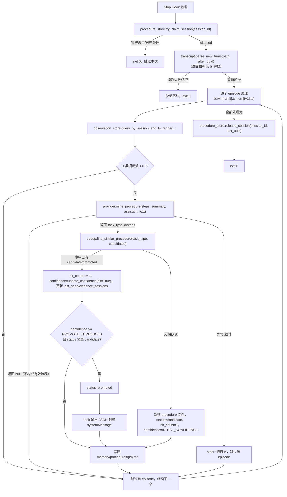
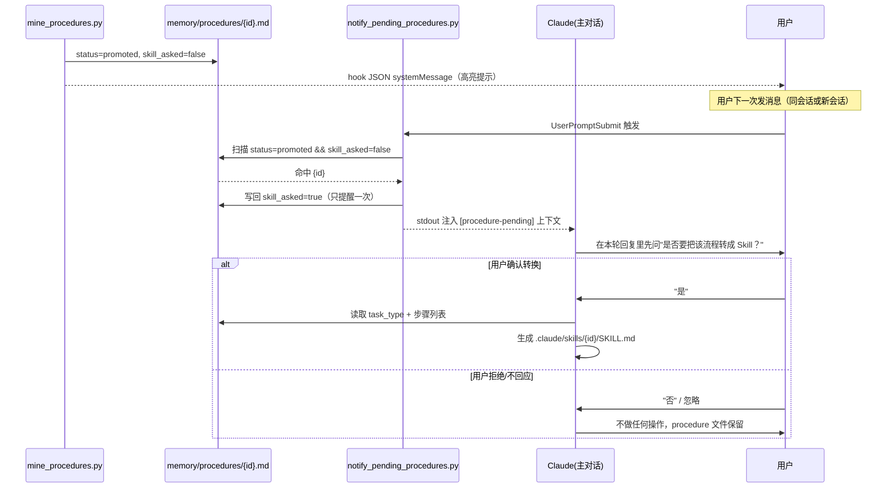

## 1. 背景与目标

同一类任务（比如"写含 mermaid 图的 md 文档，再转成带图片的 html"）在不同会话里，Claude 实际执行的工具调用序列高度相似，但目前 c-memory 只沉淀"单条 trigger→action 规则"（instinct）和"项目事实"（memory），没有任何机制把**多步骤、有序**的处理流程本身沉淀下来。

目标：新增第三条独立记忆管线——**流程挖掘**。挂在 Stop 事件上，增量分析每次会话里的"用户轮次片段"（episode），识别其中稳定复现的多步骤流程，达到复现阈值后**不注入上下文**（避免污染每次 SessionStart 的 token 开销），而是通过 `systemMessage` 高亮提示用户；用户下一次开口时，由 Claude 主动询问是否要转换为 Claude Code Skill，用户确认后由 Claude 直接读取流程记录生成 `SKILL.md`。

**技术前提**（已核实）：
- hook 无法拿到模型原始 thinking token（不稳定、不建议作为数据源），但能稳定拿到工具调用序列（`observe.py` 已记录）和 assistant 文本（`transcript.py` 已能解析）。
- Claude Code hook JSON 输出支持通用字段 `systemMessage`，会在所有 hook 事件（含 Stop）里展示给用户；Stop hook 的普通 stdout 只进调试日志，用户看不到。
- `UserPromptSubmit` hook 的 stdout 会作为上下文注入给下一轮，可用于"提醒 Claude 主动发起对话"。

## 2. 总体架构

阅读目的：确认 Stop 事件触发后，从取新增用户轮次到最终写入/提示，每一步的输入输出和异常分支。



节点实现要点：
- `Claim`/`Release`：复用 `transcript_store.py` 已验证过的 claim/release 契约（`tuple[bool, str|None]`），但用独立的 `procedure_progress` 表，不与 `summarize.py` 的游标互相干扰。
- `QueryObs`：新增 `observation_store.query_by_session_and_ts_range(session_id, ts_start, ts_end)`，按 `ts` 字段做区间查询，最后一个 episode 的区间右端开到当前时刻。
- `CallLLM`：`NullProvider.mine_procedure` 恒返回 `None`（没有 LLM 配置时不做流程挖掘，不用规则瞎猜）。
- 任何一步异常都不能让脚本非 0 退出（顶层 try/except 兜底，参照 `extract.py` 现有约定）。

## 3. 数据模型

`memory/procedures/{id}.md`，`id` 为 LLM 产出的英文 kebab-case（沿用 `extract.py._sanitize_id` 校验+兜底逻辑）：

```markdown
---
id: md-doc-with-mermaid-to-html
task_type: 编写含 mermaid 图的 md 文档并转出 html
hit_count: 3
confidence: 0.6          # 复用 instinct 的 confidence 机制：INITIAL_CONFIDENCE 起步，
                          # 每次命中 update_confidence(hit=True)，跨过 PROMOTE_THRESHOLD 才晋升
status: candidate      # candidate | promoted
skill_asked: false      # 是否已经问过用户要不要转 skill
first_seen: 2026-07-30
last_seen: 2026-07-30
evidence_sessions:
  - 32bcf8c6-...
---

## 步骤
1. Write 目标 md 文件
2. Skill(mermaid-diagram-standards) 校验图语法
3. Bash 调用 mmdc 把 mermaid 代码块渲染成图片
4. Edit 把 md 里的 mermaid 代码块替换成图片引用
5. Artifact 发布最终 html

## 说明
LLM 从 assistant 文本里提炼出的"为什么这么做"，可为空。
```

去重比对新增 `dedup.find_similar_procedure(task_type, candidates)`，复用现有 char-level Jaccard 算法，只比对 `task_type` 文本（`steps` 不参与相似度计算，避免措辞差异导致误判成两条）。晋升阈值直接复用 `memory_lib/confidence.py` 里 instinct 已有的常量，不新开配置。

## 4. 交互式转 Skill 流程

阅读目的：确认从"procedure 被提升"到"用户确认后生成 SKILL.md"之间，谁在什么时机做了什么，以及"只问一次"是如何保证的。



节点实现要点：
- `notify_pending_procedures.py`：轻量扫描（frontmatter 字段判断），命中即刻标记 `skill_asked=true` 再输出，保证幂等（不会因为用户连发几条消息而重复提醒）。
- 生成 `SKILL.md` **不是新增自动化代码**，是 Claude 在对话中用已有的 Read/Write 工具完成，套用项目里已有 Skill 的 frontmatter 格式（`name` + `description`）。
- 用户拒绝后不会再自动提醒；procedure 文件仍在 `memory/procedures/`，用户可随时手动要求转换。

## 5. 改动文件清单

| 文件 | 改动类型 | 说明 |
|---|---|---|
| `memory_lib/transcript.py` | 改 | `parse_new_turns` 返回值补 `ts` 字段 |
| `memory_lib/observation_store.py` | 改 | 新增按 `session_id + ts` 区间查询的函数 |
| `memory_lib/providers/llm.py` | 改 | `DeepSeekProvider`/`NullProvider` 加 `mine_procedure` 方法 |
| `memory_lib/dedup.py` | 改 | 新增 `find_similar_procedure` |
| `memory_lib/procedure_store.py` | 新 | procedure 文件读写 + `procedure_progress` 游标表 |
| `hooks/mine_procedures.py` | 新 | Stop hook，第三条命令 |
| `hooks/notify_pending_procedures.py` | 新 | UserPromptSubmit hook |
| `.claude/settings.json` | 改 | Stop 追加第三条 command；新增 `UserPromptSubmit` 事件 |
| `tests/test_transcript.py` | 改 | 补 `ts` 字段用例 |
| `tests/test_procedure_store.py` | 新 | 游标 claim/release |
| `tests/test_dedup.py` | 改 | 补 `find_similar_procedure` 用例 |
| `tests/test_mine_procedures.py` | 新 | 5 个场景（新建/累加/晋升/过滤/LLM 空结果） |
| `tests/test_notify_pending_procedures.py` | 新 | 3 个场景（有 pending/无 pending/已问过） |

`build.sh` 不需要改动——`hooks/`、`memory_lib/` 整目录拷贝已自动覆盖新文件。

## 6. 范围之外（本轮不做）

- procedure 数量增长后的归档/清理策略（参照现有 instinct 的 `archive/` 惯例，后续按需补）。
- `SKILL.md` 生成的具体质量校验/预览确认环节（比如生成后是否要再给用户看一眼再落盘）——本轮先跑通"问→转"的最简闭环。
- 跨项目共享 procedure（当前跟 instinct/memory 一样是项目级隔离）。
